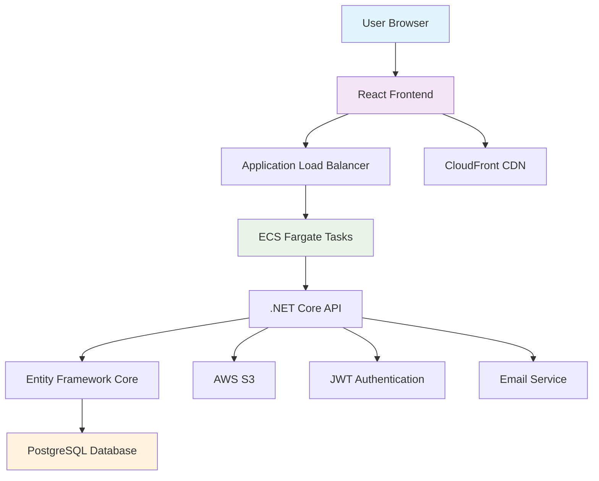

# Application Architecture

## Overview
The Real Estate Marketplace application follows a modern web architecture with a React frontend, .NET Core API backend, and SQLite/PostgreSQL database. The architecture is designed for scalability, maintainability, and security.

## Architecture Diagram

## Numbered Walkthrough

- **User Browser**: End users access the application through modern web browsers on desktop or mobile devices.

- **React Frontend**: Single Page Application built with React, TypeScript, Redux for state management, and Tailwind CSS for styling. Handles user interactions, form submissions, and API communication.

- **Application Load Balancer**: AWS ALB distributes incoming traffic across multiple ECS tasks, provides SSL termination, and performs health checks.

- **ECS Fargate Tasks**: Serverless container orchestration runs the API containers without managing underlying infrastructure. Auto-scaling based on CPU/memory usage.

- **.NET Core API**: RESTful Web API built with ASP.NET Core, implements business logic, data validation, and API endpoints for CRUD operations.

- **Entity Framework Core**: ORM layer handles database operations, migrations, and query optimization. Supports both SQLite (development) and PostgreSQL (production).

- **PostgreSQL Database**: Managed relational database storing users, properties, favorites, and other application data with proper indexing and relationships.

- **AWS S3**: Object storage for property images and other media files. Provides scalable, durable, and cost-effective storage.

- **CloudFront CDN**: Global content delivery network caches static assets at edge locations, reducing latency and improving user experience.

- **JWT Authentication**: JSON Web Tokens for secure user authentication and authorization. Tokens stored in localStorage on frontend.

- **Email Service**: Handles email notifications for user registration, password resets, and property inquiries.

## Data Flow

- User logs in → Frontend sends credentials to API → API validates and returns JWT
- User browses properties → Frontend fetches from API → API queries database → Returns paginated results
- User favorites property → Frontend sends POST to API → API saves to database → Updates user's favorites
- User uploads property → Frontend sends multipart to API → API processes and stores in S3 → Saves metadata in database

## Key Components

- **Frontend Pages**: Home, Property List, Login, Register, Favorites, Profile
- **API Controllers**: Auth, Properties, Users, Favorites
- **Models**: User, Property, Favorite, Agent
- **DTOs**: Request/Response objects for API contracts
- **Services**: Email service, authentication middleware

## Security Considerations

- HTTPS everywhere
- JWT token validation
- Input sanitization and validation
- CORS configuration
- Security headers (CSP, HSTS, etc.)
- Database connection encryption

## Scalability Features

- Horizontal scaling with ECS auto-scaling
- Database read replicas (future)
- CDN for static content delivery
- Caching layers (future Redis implementation)
- Microservices-ready architecture

This architecture provides a solid foundation for a production-ready real estate marketplace with room for future enhancements and scaling.