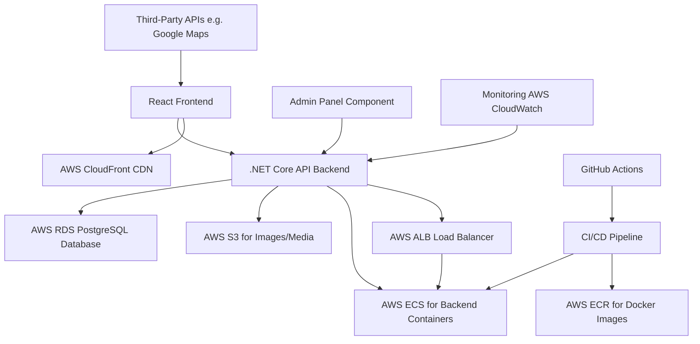
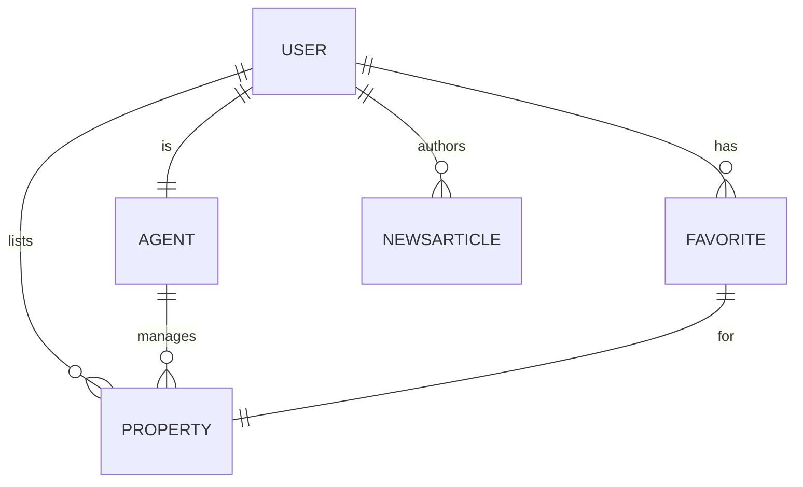

# High-Level Architecture Design for Real Estate Marketplace

## Tech Stack
- **Frontend**: React with TypeScript for type safety, Redux for state management, Tailwind CSS for styling, React Router for routing. Deployed statically on AWS S3 with CloudFront CDN for global delivery.
- **Backend**: .NET Core Web API for RESTful services, JWT authentication with ASP.NET Core Identity, Entity Framework Core for ORM. Containerized with Docker and deployed on AWS ECS.
- **Database**: PostgreSQL on AWS RDS for relational data, with automated backups and read replicas for scalability.
- **Cloud Services**: 
  - AWS S3 for storing property images and static media.
  - AWS CloudFront for CDN.
  - AWS ECS for containerized backend.
  - AWS ALB (Application Load Balancer) for traffic distribution.
  - AWS CloudWatch for monitoring and logging.
- **CI/CD**: GitHub Actions for automated build, test, and deployment pipelines.
- **Additional Tools**: Third-party integrations like Google Maps API for location features.

## High-Level Architecture Diagram
The following Mermaid diagram illustrates the overall system architecture, building on the specification:

### Key Flows:
- Users interact with the React frontend, which fetches data from the .NET Core API.
- API handles business logic, authentication, and data access via EF Core to RDS.
- Media files are stored in S3 and served via CloudFront.
- Backend is containerized in ECS behind ALB for scalability.
- CI/CD pipeline builds and deploys updates automatically.

## Components Breakdown

### Frontend Components
The frontend is a single-page application (SPA) built with React. Key components include:
- **Home Page**: Hero section with search bar, featured properties, and navigation.
- **Search and Listings Page**: Filterable list/grid view of properties (buy/rent/sold), integrated map view using Google Maps API.
- **Property Detail Page**: Image gallery, property specs, agent info, contact form, and save to favorites button.
- **User Profile/Dashboard**: Manage account, view saved favorites, list/edit properties (for sellers).
- **Agent Profile Page**: Display agent's listings, contact details, and ratings.
- **News and Advice Section**: List of articles with categories (market updates, tips), article detail pages.
- **Authentication Components**: Login, register, password reset forms with JWT handling.
- **Admin Panel**: Separate interface for admins to approve listings, manage users, and publish news (accessible via backend).
- **Shared Components**: Header/footer, modals for forms, loading spinners, error handling.

State management uses Redux for global state (user session, search filters). Styling with Tailwind CSS ensures responsiveness.

### Backend Components/Modules
The backend is modular, with each feature area as a separate module in the .NET Core project:
- **Authentication Module**: Handles JWT token generation, validation, and user registration/login using ASP.NET Core Identity.
- **Property Module**: CRUD operations for properties, including search with filters, image upload to S3, approval workflow for listings.
- **User Module**: Profile management, role-based access (Buyers, Sellers, Agents, Admins).
- **Agent Module**: CRUD for agent profiles, associating agents with properties.
- **Favorites Module**: API endpoints to add/remove favorites, retrieve user's saved properties.
- **News Module**: CRUD for articles, including rich text content and categorization.
- **Admin Module**: Administrative endpoints for user/listing management, analytics.
- **Common/Utilities**: Logging, error handling, email services, caching (consider Redis for performance).

API follows REST principles with Swagger for documentation. CORS enabled for frontend integration.

## Database Schema
The database uses PostgreSQL on AWS RDS. Below is the entity-relationship design, including key tables and relationships. This schema supports the core entities mentioned in the specification.

### Entities and Attributes
1. **User**
   - ID (Primary Key, UUID)
   - Email (Unique, string)
   - PasswordHash (string)
   - FirstName (string)
   - LastName (string)
   - Phone (string, optional)
   - Role (enum: Buyer, Seller, Agent, Admin)
   - CreatedAt (timestamp)
   - UpdatedAt (timestamp)

2. **Property**
   - ID (Primary Key, UUID)
   - Title (string)
   - Description (text)
   - Price (decimal)
   - Location (string, e.g., address)
   - Latitude (decimal, for maps)
   - Longitude (decimal, for maps)
   - PropertyType (enum: House, Apartment, etc.)
   - Bedrooms (int)
   - Bathrooms (int)
   - LandSize (decimal, optional)
   - Status (enum: Active, Sold, Rented, PendingApproval)
   - SellerID (Foreign Key to User.ID, for sellers/landlords)
   - AgentID (Foreign Key to User.ID, for agents)
   - Images (JSON array of S3 URLs)
   - CreatedAt (timestamp)
   - UpdatedAt (timestamp)

3. **Agent** (Note: Agents are also Users with Role=Agent; this table extends for additional details)
   - ID (Primary Key, UUID, same as User.ID)
   - AgencyName (string)
   - LicenseNumber (string)
   - Bio (text)
   - ProfileImage (S3 URL)

4. **Favorite**
   - ID (Primary Key, UUID)
   - UserID (Foreign Key to User.ID)
   - PropertyID (Foreign Key to Property.ID)
   - CreatedAt (timestamp)
   - Unique constraint on (UserID, PropertyID) to prevent duplicates

5. **NewsArticle**
   - ID (Primary Key, UUID)
   - Title (string)
   - Content (text, rich text)
   - Author (string, or Foreign Key to User.ID for admin authors)
   - Category (string, e.g., Market Update, Tips)
   - PublishDate (timestamp)
   - Status (enum: Draft, Published)
   - CreatedAt (timestamp)
   - UpdatedAt (timestamp)

### Relationships
- **User to Property**: One-to-Many (Seller lists properties). Many sellers can list properties, but each property has one seller. Agents are associated separately.
- **User to Agent**: One-to-One (Users with Role=Agent have an Agent profile).
- **Agent to Property**: One-to-Many (Agent manages multiple properties).
- **User to Favorite**: One-to-Many (User has many favorites).
- **Favorite to Property**: Many-to-One (Each favorite links to one property).
- **NewsArticle**: Standalone, optionally linked to User for authorship.

### ER Diagram

### Additional Schema Considerations
- Indexes: On frequently queried fields like Property.Location, Property.Status, User.Email.
- Constraints: Foreign keys with cascade delete where appropriate (e.g., delete user favorites on user delete).
- Extensions: JSONB for flexible data like property features, full-text search for description/title.
- Scaling: Use read replicas for search-heavy queries.

## Integration Points and Data Flow
- **Frontend-Backend**: RESTful API calls with JWT in headers. Frontend handles form submissions, search queries, and state updates.
- **Backend-Database**: EF Core migrations for schema changes, connection pooling for performance.
- **Media Handling**: Properties upload images to S3 via pre-signed URLs from backend, URLs stored in Property.Images.
- **Third-Party**: Google Maps API for embedded maps in property details and search.
- **Authentication**: Secure endpoints with role-based authorization (e.g., only agents/sellers can create properties).
- **Admin Panel**: Separate frontend route or component accessing admin API endpoints.
- **Monitoring**: CloudWatch integrates with ECS for logs/metrics; alerts for errors or performance issues.

## Implementation Guidance
This design provides a solid foundation aligned with the specification. Next steps:
1. Set up AWS infrastructure using CloudFormation/Terraform for RDS, ECS, etc.
2. Develop backend entities and API endpoints first.
3. Build frontend components iteratively, integrating with backend.
4. Implement CI/CD for automated deployments.
5. Add features like map integration and image galleries as specified.

The architecture ensures scalability, security, and maintainability, following best practices for a cloud-native real estate platform.