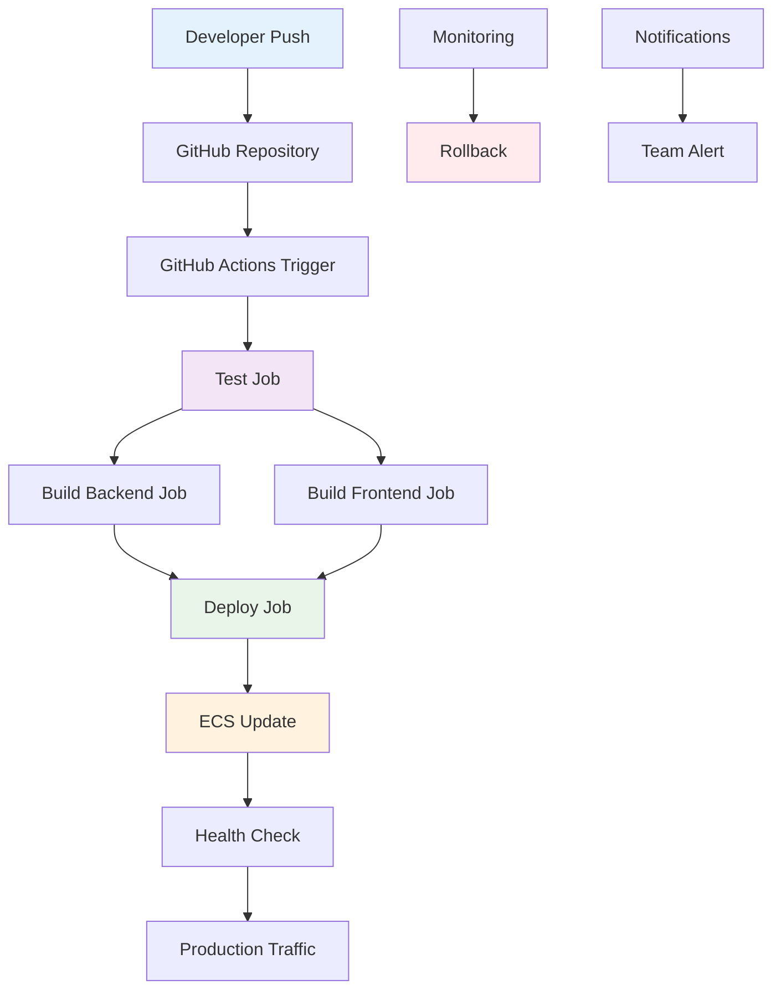

# DevOps CI/CD Architecture

## Overview
The CI/CD pipeline automates the build, test, and deployment process using GitHub Actions, ensuring consistent and reliable software delivery to AWS cloud environments.

## CI/CD Pipeline Diagram



## Numbered Walkthrough

- **Developer Push**: Developer commits code changes to Git repository (main/develop branches).

- **GitHub Repository**: Centralized version control with branching strategy and pull request reviews.

- **GitHub Actions Trigger**: Automated workflow triggered on push/PR events with YAML configuration.

- **Test Job**: Parallel execution of unit and integration tests using .NET test runner and xUnit.

- **Build Backend Job**: Compile .NET Core API, create Docker image, and push to Amazon ECR.

- **Build Frontend Job**: Install dependencies, build React app, and sync to S3 bucket.

- **Deploy Job**: Update ECS service with new container image and wait for deployment completion.

- **ECS Update**: Amazon ECS performs rolling update of Fargate tasks with zero-downtime deployment.

- **Health Check**: Automated verification that new deployment is healthy via ALB health checks.

- **Production Traffic**: Load balancer routes traffic to healthy tasks, deployment completes successfully.

- **Monitoring**: Continuous monitoring of application metrics, logs, and performance indicators.

- **Rollback**: Automated or manual rollback to previous version if deployment fails or issues detected.

- **Notifications**: Email/Slack notifications for deployment status, failures, and alerts.

- **Team Alert**: Immediate notification to development team for critical issues requiring attention.

## Pipeline Stages Detail

### Source Control
- **Git Flow**: Main branch for production, develop for integration, feature branches for development
- **PR Reviews**: Required approvals and automated checks before merge
- **Branch Protection**: Prevent direct pushes to main, require status checks

### Testing Phase
```yaml
- name: Run Tests
  run: |
    dotnet test --no-build --verbosity normal
    --collect:"XPlat Code Coverage"
```

- Unit tests for business logic
- Integration tests for API endpoints
- Code coverage reporting
- Security scanning with vulnerability checks

### Build Phase
```yaml
- name: Build and Push Backend
  run: |
    docker build -t api ./RealEstateApi
    docker tag api:latest ${{ secrets.ECR_URI }}:latest
    docker push ${{ secrets.ECR_URI }}:latest
```

- Multi-stage Docker builds for optimized images
- Frontend build optimization and asset minification
- ECR image scanning for security vulnerabilities
- S3 deployment with cache invalidation

### Deployment Phase
```yaml
- name: Deploy to ECS
  uses: aws-actions/amazon-ecs-deploy-task-definition@v1
  with:
    service: real-estate-api-service
    cluster: real-estate-cluster
    wait-for-service-stability: true
```

- Blue-green deployment strategy
- Health checks and rollback automation
- Environment-specific configurations
- Secrets management with AWS Secrets Manager

## Environment Strategy

### Development Environment
- Automated deployment on every push to develop branch
- SQLite database for fast iterations
- Basic monitoring and logging

### Staging Environment
- Deploy on PR merge to main branch
- Full AWS infrastructure mirroring production
- Integration testing and performance validation

### Production Environment
- Manual approval required for deployment
- PostgreSQL with multi-AZ setup
- Full monitoring, alerting, and backup strategies

## Quality Gates

- **Code Quality**: ESLint, SonarQube analysis
- **Security**: Dependency scanning, SAST, DAST
- **Performance**: Load testing, Lighthouse scores
- **Compliance**: Automated policy checks

## Monitoring & Observability

### Application Monitoring
- AWS CloudWatch metrics and logs
- Application Insights for .NET Core
- Real User Monitoring (RUM) for frontend
- Error tracking with correlation IDs

### Deployment Monitoring
- Deployment duration and success rates
- Rollback frequency and reasons
- Build times and failure patterns
- Resource utilization during deployments

## Security in CI/CD

- **Secrets Management**: GitHub Secrets for AWS credentials
- **Vulnerability Scanning**: Container image scanning in ECR
- **IAM Least Privilege**: Minimal permissions for CI/CD roles
- **Audit Logging**: All deployment activities logged and monitored

## Cost Optimization

- **Spot Instances**: Use for CI/CD runners where possible
- **Caching**: Docker layer caching, npm cache, NuGet cache
- **Parallel Jobs**: Maximize concurrency to reduce pipeline time
- **Resource Cleanup**: Automatic cleanup of temporary resources

## Future Enhancements

- **GitOps**: ArgoCD for Kubernetes deployments
- **Infrastructure Testing**: Terratest for Terraform validation
- **Canary Deployments**: Gradual traffic shifting
- **Feature Flags**: LaunchDarkly integration
- **Automated Testing**: End-to-end testing with Cypress in pipeline

This CI/CD architecture ensures reliable, secure, and efficient software delivery with comprehensive monitoring and automated quality assurance.