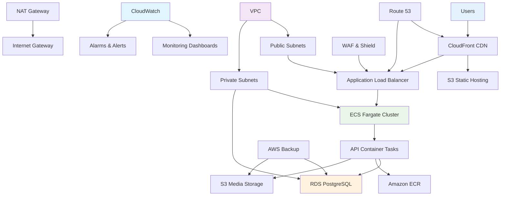

# Infrastructure Architecture

## Overview
The infrastructure is built on AWS cloud-native services using Infrastructure as Code with Terraform, providing scalable, secure, and cost-effective hosting for the Real Estate Marketplace application.

## Infrastructure Diagram



## Numbered Walkthrough

- **Users**: End users accessing the application from browsers and mobile devices globally.

- **CloudFront CDN**: Global content delivery network with 200+ edge locations for low-latency content delivery.

- **S3 Static Hosting**: Serverless static website hosting for React frontend with versioning and access logging.

- **Application Load Balancer**: Layer 7 load balancer with SSL termination, health checks, and routing rules.

- **ECS Fargate Cluster**: Serverless container orchestration managing API containers without EC2 instance management.

- **API Container Tasks**: Docker containers running .NET Core API with auto-scaling based on CPU/memory metrics.

- **RDS PostgreSQL**: Managed relational database with multi-AZ deployment, automated backups, and read replicas.

- **Amazon ECR**: Private container registry for storing and scanning Docker images for vulnerabilities.

- **S3 Media Storage**: Durable object storage for property images with lifecycle policies and cross-region replication.

- **VPC**: Virtual private cloud with CIDR 10.0.0.0/16 providing network isolation and security.

- **Public Subnets**: Subnets for ALB and NAT Gateway access with internet connectivity.

- **Private Subnets**: Subnets for ECS tasks and RDS instances without direct internet access.

- **NAT Gateway**: Network address translation for private subnet outbound traffic to AWS services.

- **Internet Gateway**: VPC component enabling internet connectivity for public subnets.

- **CloudWatch**: Comprehensive monitoring service for metrics, logs, and application insights.

- **Monitoring Dashboards**: Custom dashboards for application performance, errors, and business metrics.

- **Alarms & Alerts**: Automated notifications for CPU > 80%, 5xx errors, and unhealthy instances.

- **AWS Backup**: Centralized backup service with automated schedules and cross-region replication.

- **Route 53**: DNS service with health checks, failover routing, and global traffic management.

- **WAF & Shield**: Web application firewall and DDoS protection for API security.

## Network Architecture

### VPC Design
```
VPC: 10.0.0.0/16
├── Public Subnet AZ1: 10.0.1.0/24
├── Public Subnet AZ2: 10.0.2.0/24
├── Private Subnet AZ1: 10.0.3.0/24 (ECS, RDS)
├── Private Subnet AZ2: 10.0.4.0/24 (ECS, RDS)
└── Private Subnet AZ3: 10.0.5.0/24 (RDS Read Replica)
```

- **Availability Zones**: Multi-AZ deployment for high availability
- **Security Groups**: Instance-level firewall rules
- **NACLs**: Subnet-level network access control

## Compute Layer

### ECS Fargate Configuration
- **Task Definition**:
  - CPU: 256 units (0.25 vCPU)
  - Memory: 512 MB
  - Container Port: 80
  - Health Check: /health endpoint

- **Service Configuration**:
  - Desired Count: 1-10 (auto-scaling)
  - Deployment Type: Rolling update
  - Health Check Grace Period: 60 seconds

### Auto Scaling Policies
```hcl
resource "aws_appautoscaling_policy" "cpu" {
  policy_type        = "TargetTrackingScaling"
  target_tracking_scaling_policy_configuration {
    predefined_metric_specification {
      predefined_metric_type = "ECSServiceAverageCPUUtilization"
    }
    target_value = 70.0
  }
}
```

## Database Layer

### RDS Configuration
- **Engine**: PostgreSQL 15.4
- **Instance Class**: db.t3.medium (production)
- **Storage**: 100GB GP2 with auto-scaling
- **Multi-AZ**: Enabled for high availability
- **Backup**: Daily automated, 30-day retention
- **Maintenance**: Weekly 2-hour window

### Performance Optimization
- **Read Replicas**: For read-heavy workloads
- **Connection Pooling**: Application-level connection management
- **Indexes**: Optimized for query patterns
- **Parameter Groups**: Tuned PostgreSQL settings

## Storage Layer

### S3 Configuration
- **Frontend Bucket**: Public access via CloudFront
- **Media Bucket**: Private access via API presigned URLs
- **Versioning**: Enabled for backup and rollback
- **Lifecycle Policies**:
  - Move to IA after 30 days
  - Move to Glacier after 1 year
  - Delete after 7 years

### CloudFront Distribution
- **Origins**: S3 buckets + ALB for API
- **Behaviors**:
  - Static assets: Cache 1 year
  - API routes: No cache, forward auth headers
  - SPA routing: 404 → index.html

## Security Architecture

### Network Security
- **VPC Endpoints**: Private access to AWS services
- **Security Groups**: Least privilege access rules
- **WAF Rules**: Protection against common web attacks
- **Shield Advanced**: DDoS mitigation

### Application Security
- **IAM Roles**: Minimal permissions for ECS tasks
- **Secrets Manager**: Secure credential storage
- **KMS**: Encryption for sensitive data
- **Certificate Manager**: Free SSL certificates

### Compliance & Governance
- **Resource Tagging**: Consistent tagging strategy
- **Config Rules**: Automated compliance checks
- **CloudTrail**: Audit logging for all API calls
- **GuardDuty**: Intelligent threat detection

## Monitoring & Observability

### CloudWatch Setup
- **Metrics**: CPU, Memory, Network, Disk, Custom app metrics
- **Logs**: Centralized logging with structured JSON
- **Alarms**: Proactive alerting for issues
- **Insights**: Query and analyze log data

### Application Monitoring
- **Health Checks**: ALB target health monitoring
- **Synthetic Monitoring**: Route 53 health checks
- **Real User Monitoring**: Frontend performance tracking
- **Error Tracking**: Correlation IDs and stack traces

## Backup & Disaster Recovery

### Backup Strategy
- **Database**: Automated daily backups with PITR
- **Application**: Immutable container images in ECR
- **Static Assets**: Cross-region S3 replication
- **Infrastructure**: Terraform state versioning

### Recovery Objectives
- **RTO**: 1 hour for critical services
- **RPO**: 5 minutes for database changes
- **Multi-Region**: DR region with Route 53 failover

## Cost Optimization

### Resource Sizing
- **Right Sizing**: Based on actual usage patterns
- **Reserved Instances**: For predictable workloads
- **Savings Plans**: Compute savings for ECS
- **Spot Instances**: For development environments

### Automated Cost Management
- **Budgets**: Monthly cost alerts
- **Cost Allocation Tags**: Track spending by component
- **Resource Scheduler**: Stop dev resources during off-hours
- **Unused Resource Cleanup**: Automated cleanup scripts

## High Availability & Scalability

### Multi-AZ Deployment
- **ALB**: Cross-zone load balancing
- **ECS**: Tasks distributed across AZs
- **RDS**: Synchronous replication between AZs
- **S3**: 99.999999999% durability

### Global Distribution
- **CloudFront**: Worldwide edge network
- **Route 53**: Global DNS with latency-based routing
- **Global Accelerator**: Improved performance for global users

## Future Enhancements

### Advanced Networking
- **Transit Gateway**: Multi-VPC connectivity
- **VPC Lattice**: Service mesh capabilities
- **Cloud WAN**: Global network management

### Serverless Evolution
- **Lambda**: Event-driven processing
- **API Gateway**: Serverless API management
- **AppSync**: Real-time GraphQL APIs

### Observability Improvements
- **X-Ray**: Distributed tracing
- **OpenSearch**: Advanced log analytics
- **Managed Grafana**: Unified observability

This infrastructure architecture provides a robust, scalable, and secure foundation for the Real Estate Marketplace with comprehensive monitoring, backup, and disaster recovery capabilities.