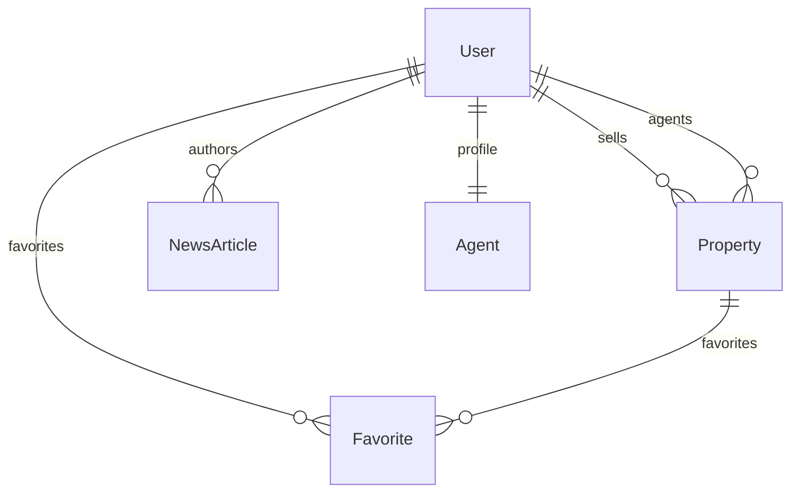

# 03 - Backend

## Technology Stack
- **Framework**: ASP.NET Core 8.0 Web API
- **Language**: C# 11 with nullable reference types
- **ORM**: Entity Framework Core 8.0
- **Database**: SQLite (development) / PostgreSQL (production)
- **Authentication**: JWT Bearer tokens with ASP.NET Core Identity
- **API Documentation**: Swagger/OpenAPI
- **Containerization**: Docker
- **Package Manager**: NuGet

## Architecture

### Clean Architecture Pattern
```
RealEstateApi/
├── Controllers/     # API endpoints
├── Services/        # Business logic (future)
├── Data/           # Data access layer
├── Models/         # Domain entities
├── DTOs/           # Data transfer objects
├── Middleware/     # Custom middleware (future)
└── Extensions/     # Extension methods
```

### API Structure
- **RESTful Design**: Standard HTTP methods and status codes
- **Versioning**: URL-based versioning (api/v1/)
- **Content Negotiation**: JSON responses with proper content types
- **Error Handling**: Consistent error response format

## Database Design

### Entity Relationships


### Key Entities

#### User
```csharp
public class User
{
    [Key]
    public Guid Id { get; set; }

    [Required]
    [EmailAddress]
    public string Email { get; set; } = string.Empty;

    [Required]
    public string PasswordHash { get; set; } = string.Empty;

    [Required]
    public string FirstName { get; set; } = string.Empty;

    [Required]
    public string LastName { get; set; } = string.Empty;

    public string? Phone { get; set; }

    [Required]
    public UserRole Role { get; set; }

    [Required]
    public DateTime CreatedAt { get; set; } = DateTime.UtcNow;

    [Required]
    public DateTime UpdatedAt { get; set; } = DateTime.UtcNow;

    // Navigation properties
    public ICollection<Property> PropertiesAsSeller { get; set; } = new List<Property>();
    public ICollection<Property> PropertiesAsAgent { get; set; } = new List<Property>();
    public Agent? Agent { get; set; }
    public ICollection<Favorite> Favorites { get; set; } = new List<Favorite>();
    public ICollection<NewsArticle> NewsArticles { get; set; } = new List<NewsArticle>();
}
```

#### Property
```csharp
public class Property
{
    [Key]
    public Guid Id { get; set; }

    [Required]
    public string Title { get; set; } = string.Empty;

    [Required]
    public string Description { get; set; } = string.Empty;

    [Required]
    [Column(TypeName = "decimal(18,2)")]
    public decimal Price { get; set; }

    [Required]
    public string Location { get; set; } = string.Empty;

    [Required]
    [Column(TypeName = "decimal(10,8)")]
    public decimal Latitude { get; set; }

    [Required]
    [Column(TypeName = "decimal(11,8)")]
    public decimal Longitude { get; set; }

    [Required]
    public PropertyType PropertyType { get; set; }

    [Required]
    public int Bedrooms { get; set; }

    [Required]
    public int Bathrooms { get; set; }

    [Column(TypeName = "decimal(10,2)")]
    public decimal? LandSize { get; set; }

    [Required]
    public PropertyStatus Status { get; set; } = PropertyStatus.PendingApproval;

    [Required]
    public Guid SellerId { get; set; }

    public Guid? AgentId { get; set; }

    [Required]
    public string ImagesJson { get; set; } = "[]";

    [Required]
    public DateTime CreatedAt { get; set; } = DateTime.UtcNow;

    [Required]
    public DateTime UpdatedAt { get; set; } = DateTime.UtcNow;

    // Navigation properties
    [ForeignKey("SellerId")]
    public User Seller { get; set; } = null!;

    [ForeignKey("AgentId")]
    public User? Agent { get; set; }

    public ICollection<Favorite> Favorites { get; set; } = new List<Favorite>();

    // Helper property for Images
    [NotMapped]
    public List<string> Images
    {
        get => JsonSerializer.Deserialize<List<string>>(ImagesJson) ?? new List<string>();
        set => ImagesJson = JsonSerializer.Serialize(value);
    }
}
```

## API Endpoints

### Authentication
```
POST /api/auth/register
POST /api/auth/login
```

### Properties
```
GET    /api/properties          # List all properties
GET    /api/properties/{id}     # Get property details
POST   /api/properties          # Create property (authorized)
PUT    /api/properties/{id}     # Update property (authorized)
DELETE /api/properties/{id}     # Delete property (authorized)
```

### Favorites
```
GET    /api/favorites           # Get user's favorites
POST   /api/favorites/{id}      # Add to favorites
DELETE /api/favorites/{id}      # Remove from favorites
```

### User Management
```
GET    /api/users/profile       # Get user profile
PUT    /api/users/profile       # Update user profile
```

## Security Implementation

### Authentication Flow
1. User registers/logs in
2. Server validates credentials
3. JWT token generated with claims (user ID, role, expiration)
4. Token returned to client
5. Client includes token in subsequent requests

### Authorization
```csharp
[Authorize]
[HttpPost("create-property")]
public async Task<IActionResult> CreateProperty([FromBody] CreatePropertyRequest request)
{
    var userIdClaim = User.FindFirst(ClaimTypes.NameIdentifier);
    if (userIdClaim == null) return Unauthorized();

    // Business logic here
}
```

### Password Security
- ASP.NET Core Identity with PBKDF2
- Password requirements: 8+ characters, mixed case, numbers, symbols
- Failed login attempt protection (future enhancement)

## Data Access Layer

### Repository Pattern (Future Implementation)
```csharp
public interface IPropertyRepository
{
    Task<Property> GetByIdAsync(Guid id);
    Task<IEnumerable<Property>> GetAllAsync(PropertyFilters filters);
    Task<Property> AddAsync(Property property);
    Task UpdateAsync(Property property);
    Task DeleteAsync(Guid id);
}
```

### Current Implementation
Direct Entity Framework usage in controllers with:
- Eager loading with Include()
- Asynchronous operations
- Transaction management
- Error handling

## Configuration Management

### appsettings.json Structure
```json
{
  "ConnectionStrings": {
    "DefaultConnection": "Data Source=realestate.db"
  },
  "Jwt": {
    "Key": "your-secret-key",
    "Issuer": "real-estate-api",
    "Audience": "real-estate-client",
    "ExpiryInMinutes": 60
  },
  "Logging": {
    "LogLevel": {
      "Default": "Information",
      "Microsoft.AspNetCore": "Warning"
    }
  }
}
```

### Environment-Specific Configuration
- Development: SQLite, detailed logging, Swagger UI
- Production: PostgreSQL, structured logging, security headers

## Error Handling

### Global Exception Handling
```csharp
public class ExceptionMiddleware
{
    private readonly RequestDelegate _next;
    private readonly ILogger<ExceptionMiddleware> _logger;

    public async Task InvokeAsync(HttpContext context)
    {
        try
        {
            await _next(context);
        }
        catch (Exception ex)
        {
            _logger.LogError(ex, "An unexpected error occurred");
            await HandleExceptionAsync(context, ex);
        }
    }
}
```

### Consistent Error Responses
```json
{
  "type": "https://tools.ietf.org/html/rfc7231#section-6.5.1",
  "title": "Bad Request",
  "status": 400,
  "detail": "Validation failed",
  "errors": {
    "Email": ["Email is required"]
  }
}
```

## Validation

### Model Validation
```csharp
public class RegisterRequest
{
    [Required]
    [EmailAddress]
    public string Email { get; set; }

    [Required]
    [MinLength(8)]
    public string Password { get; set; }

    [Required]
    public string FirstName { get; set; }

    [Required]
    public string LastName { get; set; }
}
```

### Custom Validators (Future)
- Business rule validation
- Cross-field validation
- Database constraint validation

## Testing Strategy

### Unit Testing
```csharp
[Fact]
public async Task GetProperties_ReturnsAllProperties()
{
    // Arrange
    var mockRepo = new Mock<IPropertyRepository>();
    mockRepo.Setup(repo => repo.GetAllAsync())
        .ReturnsAsync(new List<Property> { new Property { Id = Guid.NewGuid() } });

    // Act
    var result = await _controller.GetProperties();

    // Assert
    Assert.IsType<OkObjectResult>(result);
}
```

### Integration Testing
- Full API testing with TestServer
- Database integration tests
- Authentication flow testing

### Test Structure
```
tests/
├── UnitTests/
├── IntegrationTests/
└── RealEstateApi.Test.csproj
```

## Performance Optimizations

### Database Optimizations
- Eager loading vs lazy loading decisions
- Database indexing on frequently queried columns
- Query optimization with AsNoTracking()
- Connection pooling

### Caching (Future)
- Response caching with CacheOutput
- Distributed caching with Redis
- Static data caching

### Async/Await Best Practices
- All I/O operations are asynchronous
- ConfigureAwait(false) for library code
- Proper cancellation token handling

## Monitoring and Logging

### Structured Logging
```csharp
_logger.LogInformation("Property created {@Property}", new
{
    PropertyId = property.Id,
    SellerId = property.SellerId,
    CreatedAt = property.CreatedAt
});
```

### Health Checks
```csharp
builder.Services.AddHealthChecks()
    .AddDbContextCheck<ApplicationDbContext>()
    .AddUrlGroup(new Uri("https://api.external-service.com"));
```

### Metrics (Future)
- Response times
- Error rates
- Database connection pool usage
- Memory and CPU usage

## Containerization

### Dockerfile
```dockerfile
FROM mcr.microsoft.com/dotnet/aspnet:8.0 AS base
WORKDIR /app
EXPOSE 80

FROM mcr.microsoft.com/dotnet/sdk:8.0 AS build
WORKDIR /src
COPY ["RealEstateApi.csproj", "."]
RUN dotnet restore
COPY . .
RUN dotnet build -c Release -o /app/build

FROM build AS publish
RUN dotnet publish -c Release -o /app/publish

FROM base AS final
WORKDIR /app
COPY --from=publish /app/publish .
ENTRYPOINT ["dotnet", "RealEstateApi.dll"]
```

### Docker Compose (Development)
```yaml
version: '3.8'
services:
  api:
    build: .
    ports:
      - "5000:80"
    environment:
      - ASPNETCORE_ENVIRONMENT=Development
    depends_on:
      - db

  db:
    image: postgres:15
    environment:
      POSTGRES_DB: realestate
      POSTGRES_USER: realestate
      POSTGRES_PASSWORD: password
    ports:
      - "5432:5432"
```

## API Documentation

### Swagger Configuration
```csharp
builder.Services.AddSwaggerGen(c =>
{
    c.SwaggerDoc("v1", new OpenApiInfo
    {
        Title = "Real Estate API",
        Version = "v1",
        Description = "API for Real Estate Marketplace"
    });

    // JWT Bearer token support
    c.AddSecurityDefinition("Bearer", new OpenApiSecurityScheme
    {
        In = ParameterLocation.Header,
        Type = SecuritySchemeType.Http,
        Scheme = "bearer"
    });
});
```

### API Versioning (Future)
```csharp
builder.Services.AddApiVersioning(options =>
{
    options.AssumeDefaultVersionWhenUnspecified = true;
    options.DefaultApiVersion = new ApiVersion(1, 0);
});