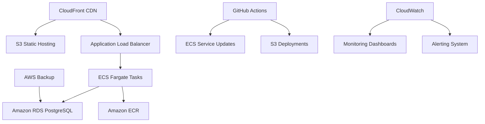

# 05 - Infrastructure

## AWS Cloud Architecture

### High-Level Architecture


## Network Infrastructure

### VPC Design
- **CIDR Block**: 10.0.0.0/16
- **Availability Zones**: 2 AZs for high availability
- **Subnets**:
  - Public subnets: ALB, NAT Gateway access
  - Private subnets: ECS tasks, RDS instances
- **Security**: Security groups, NACLs, VPC endpoints

### Security Groups Configuration
```hcl
# ALB Security Group
resource "aws_security_group" "alb" {
  name        = "real-estate-alb-sg"
  description = "ALB security group"
  vpc_id      = aws_vpc.main.id

  ingress {
    from_port   = 80
    to_port     = 80
    protocol    = "tcp"
    cidr_blocks = ["0.0.0.0/0"]
  }

  ingress {
    from_port   = 443
    to_port     = 443
    protocol    = "tcp"
    cidr_blocks = ["0.0.0.0/0"]
  }
}

# ECS Security Group
resource "aws_security_group" "ecs" {
  name        = "real-estate-ecs-sg"
  description = "ECS tasks security group"
  vpc_id      = aws_vpc.main.id

  ingress {
    from_port       = 80
    to_port         = 80
    protocol        = "tcp"
    security_groups = [aws_security_group.alb.id]
  }
}

# RDS Security Group
resource "aws_security_group" "rds" {
  name        = "real-estate-rds-sg"
  description = "RDS security group"
  vpc_id      = aws_vpc.main.id

  ingress {
    from_port       = 5432
    to_port         = 5432
    protocol        = "tcp"
    security_groups = [aws_security_group.ecs.id]
  }
}
```

## Compute Layer

### ECS Fargate Configuration
- **CPU**: 256 units (0.25 vCPU)
- **Memory**: 512 MB
- **Auto Scaling**: 1-10 tasks based on CPU utilization
- **Task Definition**:
  ```json
  {
    "family": "real-estate-api",
    "containerDefinitions": [
      {
        "name": "api",
        "image": "${ECR_REPO}:latest",
        "cpu": 256,
        "memory": 512,
        "essential": true,
        "portMappings": [
          {
            "containerPort": 80,
            "protocol": "tcp"
          }
        ],
        "environment": [
          {
            "name": "ASPNETCORE_ENVIRONMENT",
            "value": "Production"
          }
        ],
        "logConfiguration": {
          "logDriver": "awslogs",
          "options": {
            "awslogs-group": "/ecs/real-estate-api",
            "awslogs-region": "us-east-1",
            "awslogs-stream-prefix": "ecs"
          }
        }
      }
    ]
  }
  ```

### Container Registry
- **ECR Repository**: Private repository for API images
- **Image Scanning**: Automated vulnerability scanning
- **Lifecycle Policies**: Clean up old images
- **Cross-Region Replication**: For multi-region deployments

## Database Layer

### RDS PostgreSQL Configuration
- **Engine**: PostgreSQL 15.4
- **Instance Class**: db.t3.micro (dev) / db.t3.medium (prod)
- **Storage**: 20GB GP2 (auto-scaling enabled)
- **Multi-AZ**: Enabled for production
- **Backup**: Daily automated backups, 7-day retention
- **Maintenance**: Weekly maintenance windows

### Database Schema
```sql
-- Core tables
CREATE TABLE users (
    id UUID PRIMARY KEY,
    email VARCHAR(255) UNIQUE NOT NULL,
    password_hash VARCHAR(255) NOT NULL,
    first_name VARCHAR(100),
    last_name VARCHAR(100),
    phone VARCHAR(20),
    role VARCHAR(20) NOT NULL,
    created_at TIMESTAMP NOT NULL,
    updated_at TIMESTAMP NOT NULL
);

CREATE TABLE properties (
    id UUID PRIMARY KEY,
    title VARCHAR(255) NOT NULL,
    description TEXT,
    price DECIMAL(15,2) NOT NULL,
    location VARCHAR(255),
    latitude DOUBLE PRECISION,
    longitude DOUBLE PRECISION,
    property_type VARCHAR(20) NOT NULL,
    bedrooms INTEGER,
    bathrooms INTEGER,
    land_size DOUBLE PRECISION,
    status VARCHAR(20) NOT NULL,
    seller_id UUID REFERENCES users(id),
    agent_id UUID REFERENCES users(id),
    images_json JSONB,
    created_at TIMESTAMP NOT NULL,
    updated_at TIMESTAMP NOT NULL
);

-- Indexes for performance
CREATE INDEX idx_properties_location ON properties USING GIST (point(longitude, latitude));
CREATE INDEX idx_properties_price ON properties (price);
CREATE INDEX idx_properties_status ON properties (status);
CREATE INDEX idx_properties_type ON properties (property_type);
```

## Content Delivery & Storage

### CloudFront Distribution
- **Origins**: S3 bucket + ALB for API
- **Behaviors**:
  - Static assets: Cached for 1 year
  - API routes: No caching, forwarded to ALB
  - SPA routing: Redirect 404s to index.html
- **SSL**: AWS Certificate Manager (free SSL)
- **Geo Restrictions**: None (global access)
- **Price Class**: Use all edge locations

### S3 Bucket Configuration
- **Versioning**: Enabled
- **Public Access**: Blocked (served via CloudFront)
- **CORS**: Configured for web access
- **Lifecycle**: Move old versions to IA after 30 days
- **Replication**: Cross-region for disaster recovery

## Load Balancing & Scaling

### Application Load Balancer
- **Type**: Application Load Balancer
- **Listeners**: HTTP (80) with redirect to HTTPS
- **Target Groups**: IP-based targets for Fargate
- **Health Checks**: /health endpoint
- **Access Logs**: Enabled to S3

### Auto Scaling Policies
```hcl
resource "aws_appautoscaling_policy" "cpu" {
  name               = "cpu-scaling"
  policy_type        = "TargetTrackingScaling"
  resource_id        = aws_appautoscaling_target.ecs.resource_id
  scalable_dimension = aws_appautoscaling_target.ecs.scalable_dimension
  service_namespace  = aws_appautoscaling_target.ecs.service_namespace

  target_tracking_scaling_policy_configuration {
    predefined_metric_specification {
      predefined_metric_type = "ECSServiceAverageCPUUtilization"
    }
    target_value = 70.0
  }
}

resource "aws_appautoscaling_policy" "memory" {
  name               = "memory-scaling"
  policy_type        = "TargetTrackingScaling"
  resource_id        = aws_appautoscaling_target.ecs.resource_id
  scalable_dimension = aws_appautoscaling_target.ecs.scalable_dimension
  service_namespace  = aws_appautoscaling_target.ecs.service_namespace

  target_tracking_scaling_policy_configuration {
    predefined_metric_specification {
      predefined_metric_type = "ECSServiceAverageMemoryUtilization"
    }
    target_value = 80.0
  }
}
```

## Monitoring & Logging

### CloudWatch Configuration
- **Log Groups**: /ecs/real-estate-api (30-day retention)
- **Metrics**: CPU, Memory, Network, Disk usage
- **Alarms**:
  - CPU > 80% for 5 minutes
  - Memory > 80% for 5 minutes
  - HTTP 5xx errors > 10 in 5 minutes
  - ALB healthy hosts < minimum

### Application Insights (Future)
```csharp
builder.Services.AddApplicationInsightsTelemetry(options =>
{
    options.ConnectionString = builder.Configuration["ApplicationInsights:ConnectionString"];
});
```

## Backup & Disaster Recovery

### Database Backups
```hcl
resource "aws_backup_plan" "database" {
  name = "real-estate-database-backup"

  rule {
    rule_name         = "daily-backup"
    target_vault_name = aws_backup_vault.main.name
    schedule          = "cron(0 2 ? * * *)"  # 2 AM daily
    start_window      = 60
    completion_window = 120

    lifecycle {
      delete_after = 30  # Keep for 30 days
    }

    copy_action {
      destination_vault_arn = aws_backup_vault.dr.arn
    }
  }
}
```

### S3 Cross-Region Replication
```hcl
resource "aws_s3_bucket_replication_configuration" "replication" {
  role = aws_iam_role.replication.arn
  bucket = aws_s3_bucket.frontend.id

  rule {
    id     = "replicate-to-dr-region"
    status = "Enabled"

    destination {
      bucket        = aws_s3_bucket.frontend_dr.arn
      storage_class = "STANDARD_IA"
    }
  }
}
```

## Cost Optimization

### Reserved Instances (Production)
- **RDS**: Reserved instance for database
- **ECS**: Savings plan for compute

### Spot Instances (Development/Staging)
- Use spot instances for non-production workloads
- Fallback to on-demand if spot unavailable

### Resource Tagging
```hcl
locals {
  common_tags = {
    Project     = "Real Estate Marketplace"
    Environment = var.environment
    Owner       = "DevOps Team"
    CostCenter  = "Engineering"
    Backup      = "Daily"
  }
}
```

## Security

### Network Security
- **VPC Endpoints**: For AWS services (ECR, CloudWatch)
- **NAT Gateway**: For private subnet outbound traffic
- **Security Groups**: Least privilege principle
- **NACLs**: Additional network layer security

### Application Security
- **WAF**: AWS WAF for API protection (future)
- **Shield**: AWS Shield Standard (free)
- **Secrets Manager**: For database credentials
- **KMS**: For encryption keys

### Identity & Access Management
```hcl
resource "aws_iam_role" "ecs_execution" {
  name = "real-estate-ecs-execution-role"

  assume_role_policy = jsonencode({
    Version = "2012-10-17"
    Statement = [
      {
        Action = "sts:AssumeRole"
        Effect = "Allow"
        Principal = {
          Service = "ecs-tasks.amazonaws.com"
        }
      }
    ]
  })
}

resource "aws_iam_role_policy_attachment" "ecs_execution" {
  role       = aws_iam_role.ecs_execution.name
  policy_arn = "arn:aws:iam::aws:policy/service-role/AmazonECSTaskExecutionRolePolicy"
}
```

## Performance Optimization

### Database Performance
- **Read Replicas**: For read-heavy workloads
- **Connection Pooling**: Configured in application
- **Query Optimization**: Indexes and query analysis
- **Caching**: Redis for session and application cache (future)

### CDN Optimization
- **Cache Behaviors**: Different TTLs for different content types
- **Edge Locations**: Global distribution
- **Compression**: Gzip/Brotli enabled
- **HTTP/2**: Enabled for better performance

### ECS Optimization
- **Task Sizing**: Right-sized CPU and memory
- **Service Discovery**: AWS Cloud Map (future)
- **Circuit Breakers**: Resilience patterns
- **Health Checks**: Proper health check configuration

## Compliance & Governance

### Resource Naming Convention
```
{project}-{component}-{environment}-{region}
Examples:
real-estate-api-prod-us-east-1
real-estate-db-dev-us-east-1
real-estate-frontend-staging-us-west-2
```

### Tagging Strategy
- **Required Tags**: Environment, Project, Owner, CostCenter
- **Optional Tags**: Backup, Compliance, DataClassification
- **Automated Tagging**: Via Terraform locals

## Future Enhancements

### Multi-Region Architecture
- **Active-Active**: Global deployment with Route 53
- **Disaster Recovery**: Cross-region failover
- **Data Replication**: PostgreSQL logical replication

### Serverless Components
- **Lambda**: For background processing
- **API Gateway**: Alternative to ALB for serverless APIs
- **EventBridge**: For event-driven architecture

### Advanced Networking
- **VPC Lattice**: Service-to-service communication
- **AWS App Mesh**: Service mesh for microservices
- **Direct Connect**: For hybrid cloud scenarios

### Cost Management
- **AWS Cost Explorer**: Detailed cost analysis
- **Budgets**: Automated cost alerting
- **Savings Plans**: Compute savings
- **Spot Instances**: For batch processing

## Infrastructure Testing

### Terratest Integration
```go
func TestECSService(t *testing.T) {
    t.Parallel()

    terraformOptions := &terraform.Options{
        TerraformDir: "../terraform",
        Vars: map[string]interface{}{
            "environment": "test",
        },
    }

    defer terraform.Destroy(t, terraformOptions)
    terraform.InitAndApply(t, terraformOptions)

    // Verify ECS service is running
    serviceName := terraform.Output(t, terraformOptions, "ecs_service_name")
    clusterName := terraform.Output(t, terraformOptions, "ecs_cluster_name")

    assert.ECSServiceExists(t, serviceName, clusterName)
}
```

### Chaos Engineering
- **AWS Fault Injection Simulator**: Simulate failures
- **Chaos Monkey**: Terminate random instances
- **Latency Injection**: Network simulation

This infrastructure specification provides a scalable, secure, and cost-effective foundation for the Real Estate Marketplace application, designed for production deployment with room for future enhancements.