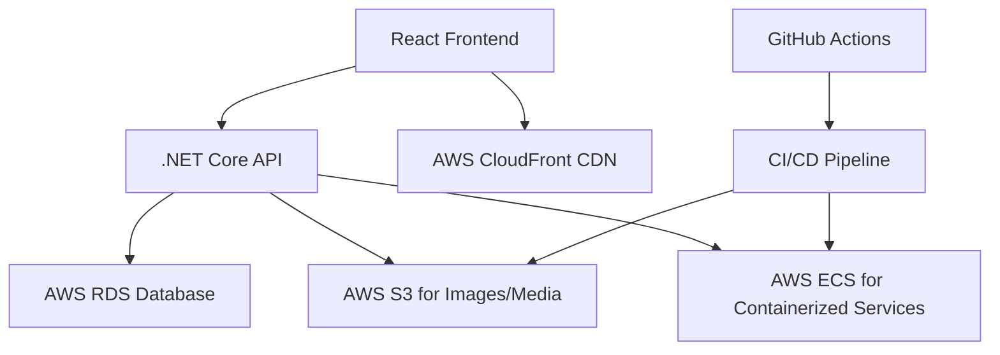

# Real Estate Marketplace Specification

## Overview
This specification outlines the design and implementation of a full-stack real estate marketplace inspired by domain.com.au. The platform will allow users to search, list, and manage real estate properties, interact with agents, and access relevant news and advice. The solution will be built using industry best practices, deployed on AWS cloud-native services, and utilize GitHub Actions for CI/CD.

## Core Features
Based on user requirements and analysis of similar platforms:
- **Property Search and Listings**: Comprehensive search functionality with filters (location, price, property type, bedrooms, etc.) for buy, rent, and sold properties.
- **User Accounts**: Registration, login, profile management with JWT authentication.
- **Agent Profiles**: Dedicated profiles for real estate agents with contact information and listings.
- **Favorites/Save Listings**: Users can save favorite properties for later reference.
- **News and Advice Section**: Blog-style content with real estate tips, market updates, and advice.

Additional features to consider:
- Map integration for property locations.
- Image galleries for properties.
- Contact forms for inquiries.
- Admin panel for managing listings and users.
- Responsive design for mobile and desktop.

## User Roles
- **Buyers/Renters**: Search and view properties, save favorites, contact agents.
- **Sellers/Landlords**: List properties (with approval process).
- **Agents**: Manage their listings, view leads from inquiries.
- **Admins**: Oversee the platform, approve listings, manage content.

## Technical Architecture

### High-Level Architecture

### Frontend
- **Technology**: React with TypeScript for type safety.
- **State Management**: Redux or Context API.
- **Styling**: CSS-in-JS (styled-components) or Tailwind CSS.
- **Routing**: React Router.
- **Deployment**: Static hosting on AWS S3 + CloudFront.

### Backend
- **Technology**: .NET Core Web API.
- **Authentication**: JWT tokens with ASP.NET Core Identity.
- **Data Access**: Entity Framework Core for ORM.
- **API Design**: RESTful API with Swagger documentation.
- **Deployment**: Containerized with Docker, hosted on AWS ECS.

### Database
- **Type**: Relational (SQLite for development, PostgreSQL on AWS RDS for production).
- **Schema**: Tables for Users, Properties, Agents, Favorites, News Articles, etc.
- **Backup and Scaling**: Automated backups, read replicas for scalability.

### AWS Cloud-Native Deployment
- **Compute**: AWS ECS (Elastic Container Service) for API containers.
- **Storage**: AWS S3 for property images and static assets.
- **CDN**: AWS CloudFront for global content delivery.
- **Database**: AWS RDS for managed database.
- **Security**: AWS IAM, VPC, security groups.
- **Monitoring**: AWS CloudWatch for logs and metrics.
- **Load Balancing**: AWS ALB (Application Load Balancer).

### CI/CD Pipeline
- **Tool**: GitHub Actions.
- **Stages**:
  - Build: Compile and test code.
  - Test: Run unit and integration tests.
  - Deploy: Push Docker images to ECR, update ECS services.
- **Environments**: Development, Staging, Production.

## Industry Best Practices
- **Security**: HTTPS, data encryption, input validation, OWASP top 10 compliance.
- **Performance**: Lazy loading, caching (Redis), optimized images.
- **Scalability**: Microservices architecture potential, horizontal scaling.
- **Accessibility**: WCAG compliance.
- **SEO**: Server-side rendering (Next.js) or prerendering.
- **Testing**: Unit tests, integration tests, end-to-end tests with Selenium or Cypress.
- **DevOps**: Infrastructure as Code with CloudFormation or Terraform.
- **Monitoring and Logging**: Centralized logging, error tracking with tools like ELK stack.
- **Version Control**: Git with feature branches and pull requests.

## Development Phases
1. **Planning and Design**: Finalize requirements, wireframes, database schema.
2. **Backend Development**: Implement API endpoints, database setup.
3. **Frontend Development**: Build UI components, integrate with API.
4. **Integration and Testing**: End-to-end testing, performance optimization.
5. **Deployment and Monitoring**: Setup AWS infrastructure, CI/CD, monitoring.

## Risks and Mitigations
- **Data Privacy**: Compliance with GDPR/CCPA, secure handling of user data.
- **Scalability**: Start with MVP, plan for growth.
- **Third-Party Integrations**: API keys management, fallback strategies.

## Current Implementation Status

### Completed Features
- **Backend API**: .NET Core Web API with Entity Framework Core, SQLite database (development), JWT authentication.
- **Frontend**: React with TypeScript, Redux for state management, Tailwind CSS for styling.
- **Database Models**: Users, Properties, Agents, Favorites, News Articles with relationships.
- **API Endpoints**:
  - Authentication: Register, Login
  - Properties: CRUD operations with authorization
  - Favorites: Add/Remove/Get user favorites
  - Users: Profile management
- **Frontend Pages**: Home, Property List, Login, Register, Favorites, Profile.
- **Deployment Ready**: Frontend builds to static assets, Backend containerizable with Docker.

### Pending/Additional Features
- Map integration for property locations
- Image upload and gallery functionality
- News/Articles section
- Admin panel
- Email notifications
- Advanced search filters
- Pagination for listings

### Testing
- Unit tests implemented for backend controllers using xUnit and InMemory database.
- Integration tests implemented for backend API using WebApplicationFactory and Sqlite.
- Unit tests implemented for frontend using React Testing Library.
- Manual testing completed for basic functionality.

### Infrastructure as Code
- Terraform configuration provided for AWS deployment (see terraform/ directory).
- Includes VPC, ECS Fargate, RDS PostgreSQL, ALB, S3, CloudFront, ECR, and IAM roles.
- Supports automated deployment with CI/CD integration.

This specification provides a comprehensive blueprint. Further details can be added based on specific requirements or discoveries during implementation.